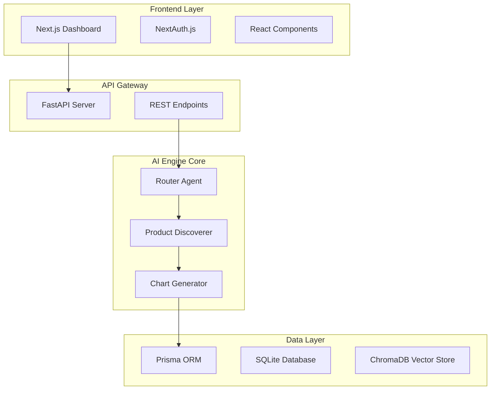

# 🚀 Prompt2Insight

**AI-Powered E-commerce Intelligence Platform**

Prompt2Insight is a sophisticated full-stack application that transforms natural language queries into intelligent product discoveries with dynamic chart visualizations. Built with cutting-edge AI technology, it provides users with comprehensive product insights through an intuitive conversational interface.

## ✨ Features

### 🧠 **Intelligent Query Processing**
- **Master Router Agent**: Classifies user intent using Gemini AI
- **Multi-Agent Architecture**: Specialized agents for different query types
- **Natural Language Understanding**: Process complex product search queries

### 🔍 **Advanced Product Discovery**
- **AI-Powered Research**: Gemini AI with structured data extraction
- **Real-time Web Scraping**: Amazon and Flipkart integration
- **Smart Product Matching**: Finds relevant products with specifications

### 📊 **Dynamic Visualization**
- **Server-Side Chart Generation**: Matplotlib-powered visualizations
- **Interactive Charts**: Price comparison and specification radar charts
- **Real-time Updates**: Charts generated on-demand with latest data

### 🔐 **Secure User Management**
- **NextAuth.js Integration**: Secure authentication system
- **Session Management**: Persistent user sessions and query history
- **Role-Based Access**: User and admin roles

### 📱 **Modern UI/UX**
- **Responsive Design**: Works seamlessly on desktop and mobile
- **Real-time Interface**: Live query processing with loading states
- **Professional Styling**: Modern design with Tailwind CSS

## 🏗️ Architecture

## 🛠️ Tech Stack

### **Frontend**
- **Framework**: Next.js 15 with TypeScript
- **Styling**: Tailwind CSS + shadcn/ui components
- **Authentication**: NextAuth.js
- **State Management**: React hooks + Context API
- **Charts**: Chart.js integration for fallback support

### **Backend**
- **Framework**: FastAPI (Python)
- **AI/ML**: Google Gemini AI API with Function Calling
- **Visualization**: Matplotlib for server-side chart generation
- **Web Scraping**: Custom scrapers for e-commerce platforms
- **Vector Database**: ChromaDB for embedding storage

### **Database**
- **ORM**: Prisma
- **Database**: SQLite (development), PostgreSQL-ready (production)
- **Migrations**: Automated database schema management

### **DevOps**
- **Containerization**: Docker support
- **Environment**: Python virtual environments
- **Development**: Hot reload for both frontend and backend

## 🚀 Quick Start

### Prerequisites
- **Node.js** 18+ and npm/pnpm
- **Python** 3.11+
- **Google Gemini API Key**
- **Git**

## 📊 Features in Action

### 1. **Intelligent Query Processing**
- User: *"Find gaming laptops under 80k with RTX graphics"*
- System: Routes to product discovery → Finds 5 relevant laptops → Generates price comparison chart

### 2. **Dynamic Chart Generation**
- Automatic price comparison bar charts
- Multi-dimensional specification radar charts
- Real-time chart toggle functionality

### 3. **Comprehensive Product Data**
- Structured product information
- Price tracking and comparison
- Detailed specifications analysis
- User ratings and reviews

*Built with ❤️ using cutting-edge AI technology*
=======

